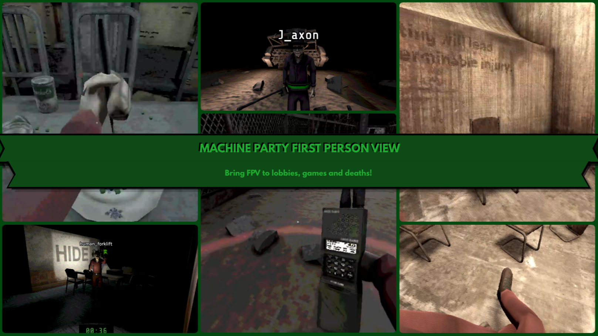
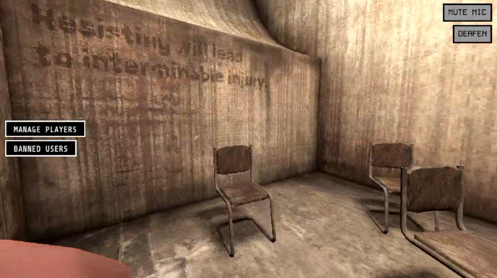
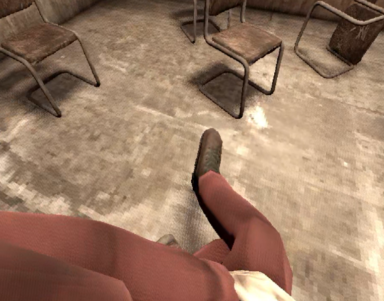
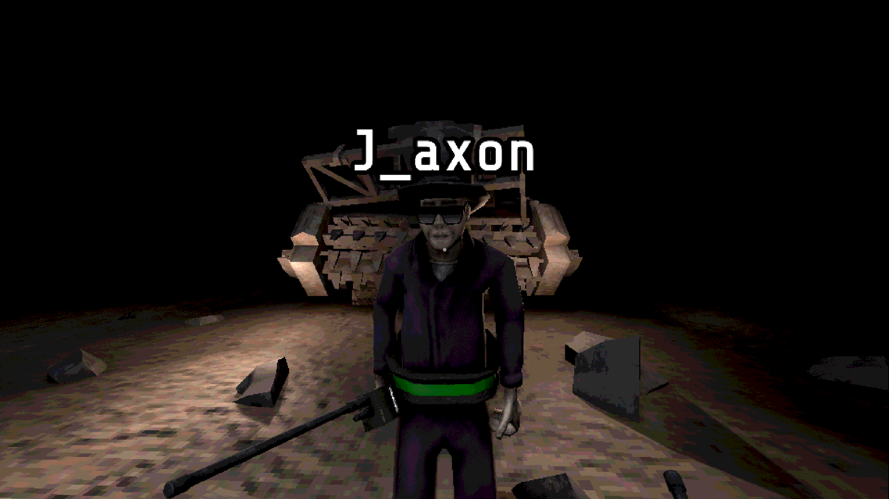
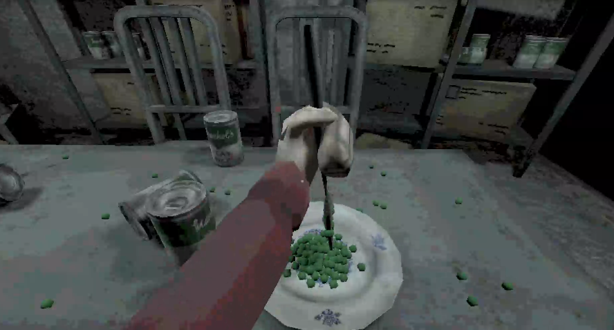
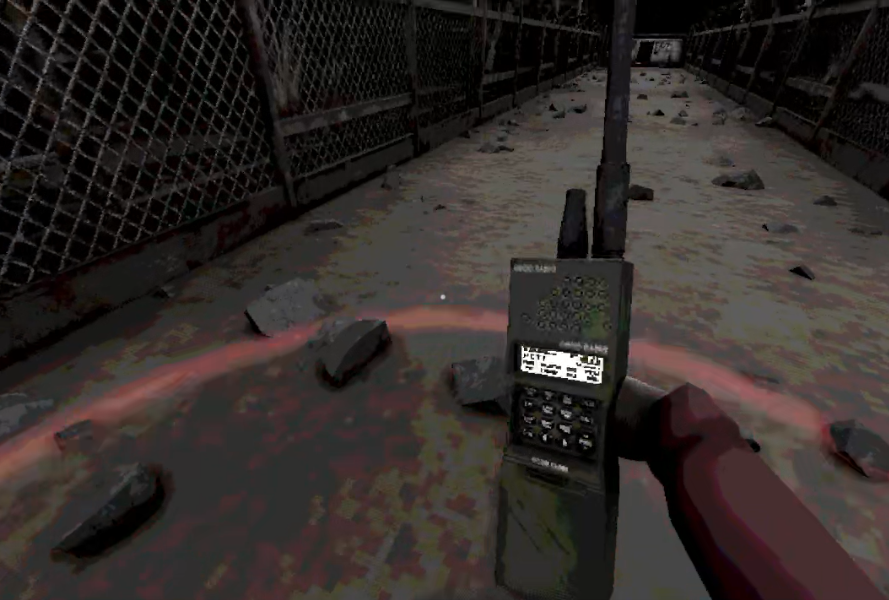
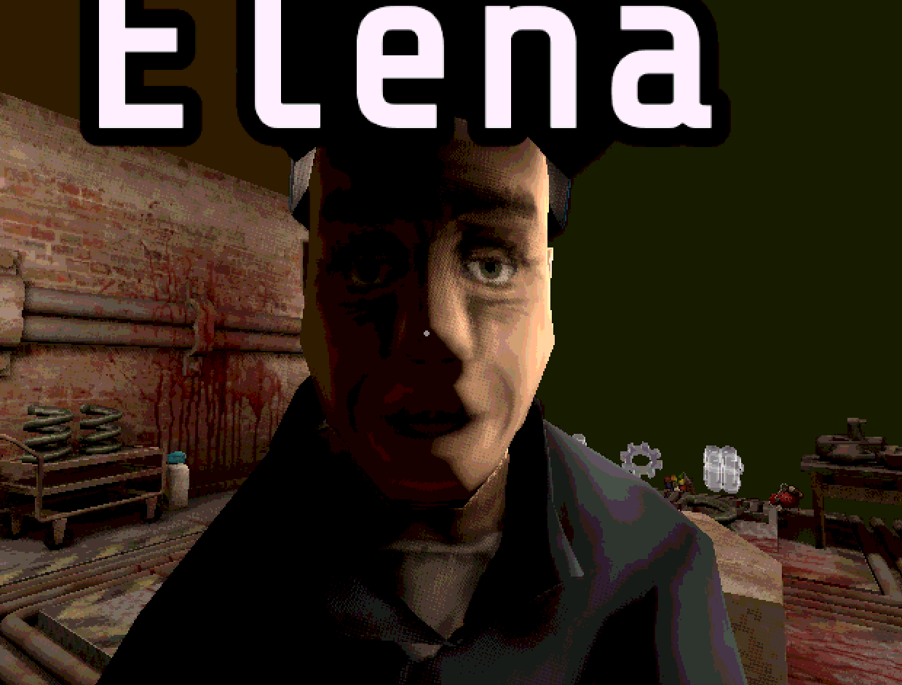
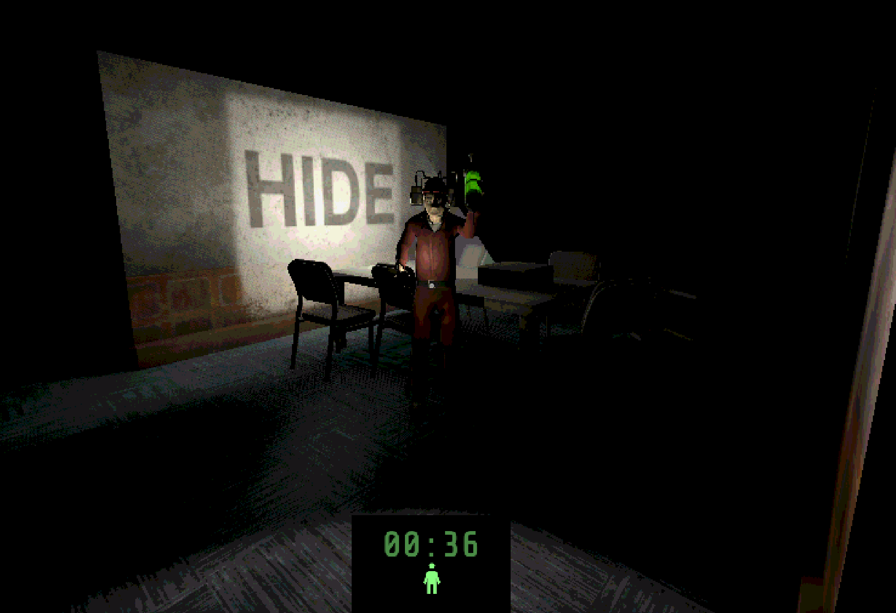

<h1 align="center">MachinePartyFPV</h1>

<p align="center"><b>Made by J_axon and Krunk</b></p>

<p align="center">
  
</p>

<p align="center"><b>Bring FPV to lobbies, games and deaths.</b></p>

**MachinePartyFPV puts you inside your own character in Machine Party.** Instead of the game's fixed third-person cameras, you see every minigame through your character's own eyes, look around freely with the mouse or a controller, watch your own death play out in first person, and even stand around the lobby in first person while you wait.

It is a purely visual, client-side mod. It does not touch networking, it does not repack or modify the game's data files, and it works whether or not anyone else in your lobby has it. It is styled with the game's own fonts and fits right in.

Created by **J_axon** and **Krunk**.

> **Credit required.** You are free to use MachinePartyFPV's code in your own projects under the MIT License. If you reuse any of it, you must credit **J_axon** and **Krunk** and keep the license notice included. Please keep that credit visible and easy to find, for example in your README, mod description, or in-game credits.

### A note on the project

MachinePartyFPV was built together by **J_axon** and **Krunk**. Krunk has since stepped away and is no longer actively working on the mod, so from here on **J_axon** is maintaining MachinePartyFPV and taking it forward. Krunk's work stays an equal, permanent part of the project: **Krunk keeps full and equal credit** for everything we made together, and the copyright and license are unchanged. Thank you, Krunk.

---

## Features

- **First person in every minigame** — see the game through your character's eyes, with free mouse and controller look.
- **Per-game camera tuning** — seated and stationary games (Smoke Break, Table Manners, Recycle, Forklift) get a sensible look limit so you can glance around without spinning in your chair; action games are free look.
- **Lobby FPV** — stand in the waiting room in first person and look around while everyone gets ready.
- **First-person deaths, then a clean spectate** — when you die you watch it happen in first person (the body drop, the exploding-collar hat, the crush), and then the view hands cleanly to the game's own third-person camera until the next round, where first person comes right back.
- **Smart per-game death handling** — Forklift stays in first person when someone is eliminated and only cuts away for the crate "take the package away" tie scene; Recycle keeps you in first person while another player is crushed; a Duck Hunt runner who reaches the exit drops straight to the spectator view.
- **Custom in-world HUD** — a leather collar belt that lights up as you near a mine in Minefield, a burning cigarette meter and a digital round timer in Smoke Break, a damage flash when you take a hit, and a pulsing red vignette when you are down to your last life.
- **Two HUD styles** — pick the detailed art or a clean, simple box-and-bar look with one toggle.
- **Separate mouse and controller sensitivity** — two independent sliders, saved between sessions.
- **Everything is optional and remembered** — every feature is a toggle in the in-game FPV Settings menu, and your choices are saved.

MachinePartyFPV is a pure GDScript mod loaded through the **[Machine Party Mod Loader](https://github.com/Krunk-theduck/MachinePartyModLoader)**.

---

## How it works

Machine Party is normally a third-person game: each minigame has one fixed camera looking at the play area. MachinePartyFPV runs entirely on your own machine and, while you're playing, quietly parks the game's camera and drives its own camera from your character's head bone instead. Nothing is sent over the network, and no game files are changed.

Because it is 100% local and visual:

- **It works with vanilla players.** You do not both need it. Other players see the normal game; you see first person. Nothing about the match changes for anyone else.
- **It never affects gameplay, scoring, or hit detection.** It only moves the camera and draws a little HUD on your screen.
- **When you die,** it hands the camera back to the game's own third-person spectator camera, so you get the exact view the base game would show, and first person returns automatically on the next round.

---

## First person, everywhere

### In the lobby

<p align="center">
  
  
</p>

Turn on **Lobby FPV** and you can stand in the waiting room in first person. **Hold Shift** (keyboard) or the **Left Bumper** (controller) to look around from your character's eyes; let go and the view stays where you left it. It works in both the online lobby and the local couch lobby.

### In the minigames

<p align="center">
  
  
</p>

Every minigame is played from your character's eyes. You look with the mouse or the right stick. In the seated games the view is gently limited so you can look around your workstation without whipping all the way around; in the fast, moving games it's fully free, and in the movement games your character walks in the direction you're looking.

### Deaths and spectating

<p align="center">
  
</p>

Dying is the fun part. You ride your own death out in first person, then the mod turns FPV fully off and hands the camera to the game's own third-person spectator view, and first person returns on the next round.

<p align="center">
  
  
</p>

Each game gets timing that matches its animation:

- **Minefield** — your exploding collar pops your hat off; the camera rides the flying hat for about 5 seconds, then hands to third person.
- **Firearm Factory / Table Manners / Duck Hunt** — you watch your body drop for a few seconds, then hand to third person.
- **Wrong Way / Debris Platform** — you ride the crush or the fall, then hand to third person.
- **Forklift** — getting eliminated keeps you in first person on your own vehicle; the view only turns fully off for the crane "take the package away" tie scene, and comes back next round.
- **Recycle** — when another player is crushed, you stay in first person; you only leave first person when it's actually *you* who gets crushed.
- **Duck Hunt** — reach the exit as the runner and the mod turns FPV off straight to the spectator camera.

Prefer to just linger on your own body instead of cutting to spectate? There's a **Stay After Body Drop** toggle for that.

---

## The FPV Settings menu

Open the pause menu (**Esc**) and you'll find an **FPV Settings** button in the MODS section. It opens a panel with everything the mod does:

- **First Person View** — the master on/off switch.
- **In-Depth HUD Art** — on for the detailed collar belt and burning cigarette; off for a clean, simple box and bar. The round timer shows either way.
- **Lobby FPV** — first person in the waiting room (hold Shift / Left Bumper to look).
- **Stay After Body Drop** — when you die in a game that would cut to spectate, stay on your own body until the round ends instead.
- **Experimental: Hold Shift to Re-lock View** — press Shift (keyboard) or the Left Bumper (controller) to re-center your look in the seated games.
- **Mouse Sensitivity** and **Controller Sensitivity** — two separate sliders. Each one only affects its own input, and both are saved.

Every setting is remembered between sessions.

---

## Controls

| Input | Action |
|---|---|
| **Mouse** | Look around (while the game has your cursor captured) |
| **Right stick** | Look around on a controller |
| **Shift** (kb) / **Left Bumper** (pad) | Hold to look in **Lobby FPV**; also re-centers your view if the experimental re-lock toggle is on |
| **Esc** | Pause menu → **FPV Settings** |

Mouse and controller sensitivity are set independently in the FPV Settings menu.

---

## The HUD

MachinePartyFPV draws a small amount of first-person HUD, all of it optional through the **In-Depth HUD Art** toggle:

- **Minefield collar belt** — a leather belt with a metal buckle whose warning light is your exploding collar. It reads your live mine proximity, going from green when you're safe to red as you close in, and pulses when it's about to blow. (Simple mode: a colored box.)
- **Smoke Break cigarette + timer** — a lit cigarette that burns down as you smoke, with a glowing ember and a wisp of smoke, plus a red digital round timer at the top of the screen that matches the game's own clock. (Simple mode: a plain bar. The timer always shows.)
- **Damage flash** — a quick red flash and a small camera jolt when you take a non-fatal hit.
- **Last-life vignette** — a pulsing red vignette around the screen when you're down to your final life.
- **Inside Job infection flash** — a red flash during the transformation.

---

## Works with vanilla players

MachinePartyFPV is entirely client-side and visual, so it is fully cross-compatible with players who don't have it. You do **not** both need it to play together. It changes only what *you* see; everyone else sees the normal game, and the match, scoring, and connection are untouched. You can host or join vanilla players exactly as normal.

---

## Installation

MachinePartyFPV runs through the **[Machine Party Mod Loader](https://github.com/Krunk-theduck/MachinePartyModLoader)** by Krunk-theduck. You install the loader once, then drop MachinePartyFPV into the mods folder. Because the mod is purely visual and local, **only you** need it installed to use it, you can play with vanilla players freely.

### Step 1: Install the Machine Party Mod Loader

1. **Find your game folder.** In Steam, right-click **Machine Party** in your library, choose **Manage**, then **Browse local files**. Open the **`Machine Party_Windows`** folder. It contains **`Machine Party.exe`** and **`Machine Party.pck`**.
2. **Download the loader.** Get **`MachinePartyModLoader.exe`** from the loader's releases page (extract it first if it comes as a `.zip`):
   https://github.com/Krunk-theduck/MachinePartyModLoader/releases
3. **Place the loader.** Drag **`MachinePartyModLoader.exe`** into that game folder so it sits right next to **`Machine Party.exe`** and **`Machine Party.pck`**.
4. **Run it.** Double-click **`MachinePartyModLoader.exe`**. If Windows shows a security warning, click **More info** then **Run anyway**. A command window shows the setup progress and closes when it's done. This creates a **`mods`** folder in your game directory.

### Step 2: Install MachinePartyFPV

1. Download **`Jarunk-MachinePartyFPV.zip`** from this repo's releases page:
   https://github.com/Ghostx10742/MachinePartyFPVmod/releases
2. Extract it into the **`mods`** folder inside your game folder, so you end up with the folder (not a zip) at:
   ```
   <your Machine Party folder>\mods\Jarunk-MachinePartyFPV\
   ```
   That folder should contain `fpv_controller.gd`, `main.gd`, `mod.json`, and the `overrides` folder.

### Step 3: Launch and play

1. **Start Machine Party from Steam exactly like you always have.** The mod loader hooks in automatically, there's no special shortcut.
2. To check the loader is active, press the backtick key **`` ` ``** in-game; a small debug console appears if it's working.
3. Press **Esc** to open the pause menu and click **FPV Settings** to confirm the mod loaded. If that button is there, you're good, everything is on by default.

To uninstall, delete the `Jarunk-MachinePartyFPV` folder from `mods`. To play fully vanilla again, remove the loader (or just delete the mod folder).

---

## Game updates

MachinePartyFPV runs on top of the Machine Party Mod Loader, so a future Machine Party update can temporarily break the loader (and with it, this mod). If that happens, mods may stop loading, or a specific minigame's camera may look off if the game changed how it's built.

If that happens, don't panic and don't keep reinstalling. Wait for the mod loader (and this mod) to push an update, then update and launch again. Your normal, unmodded game is never affected.

---

## Building from source

MachinePartyFPV is pure GDScript, so there is no compile step. The Machine Party Mod Loader loads mods as **loose folders**, so "building" just means zipping the mod folder for release, so that extracting it into `mods` gives you `mods/Jarunk-MachinePartyFPV/`.

Requirements: git, and Python 3 (used only to package the zip).

1. Clone the repo:
   ```bash
   git clone https://github.com/Ghostx10742/MachinePartyFPVmod.git
   cd MachinePartyFPVmod
   ```
2. Build the release zip:
   ```bash
   python build.py
   ```
   This writes `dist/Jarunk-MachinePartyFPV.zip`.
3. Install it for testing: extract the zip into your game's `mods` folder (so you get `mods/Jarunk-MachinePartyFPV/`), then launch Machine Party normally from Steam.

Dev loop: edit the GDScript in `Jarunk-MachinePartyFPV/`, copy the folder into the game's `mods` folder (or re-run `build.py` and extract), and relaunch.

Repo layout:

```
Jarunk-MachinePartyFPV/    the mod source (fpv_controller.gd, main.gd, mod.json, overrides/)
dist/                      the built, ready-to-install zip
assets/                    readme screenshots
build.py                   packages the mod into dist/
```

Almost all of the mod lives in `Jarunk-MachinePartyFPV/fpv_controller.gd`, one file that finds your local player each frame, drives the first-person camera, draws the HUD, and handles the per-game camera and death behavior.

---

## Credits

- Created by **J_axon** and **Krunk**.
- Loaded through the **[Machine Party Mod Loader](https://github.com/Krunk-theduck/MachinePartyModLoader)** by **Krunk-theduck**.

MachinePartyFPV is now maintained by **J_axon**. Krunk has stepped away from active development but keeps **full and equal credit** for the work we built together.

---

## License

MachinePartyFPV is released under the **MIT License**. You are free to use, modify, and include this code in any project, including your own mods, for free. The one requirement is that you keep the credit to **J_axon** and **Krunk** (the copyright and permission notice from the LICENSE file) included with the code. Please also credit both somewhere visible in any project that reuses it. See the [LICENSE](LICENSE) file for the full terms.

---

## AI disclosure

AI was used during the development of this project, mainly for revisions, inquiries, and things I just did not know. This does not mean the mod was fully AI-made, but rather that AI was used as part of the development process. I wanted to disclose this for people who may have a problem with AI being involved and may not want anything to do with it. Even though I disagree with your view on AI, I still respect your opinion on the subject.
